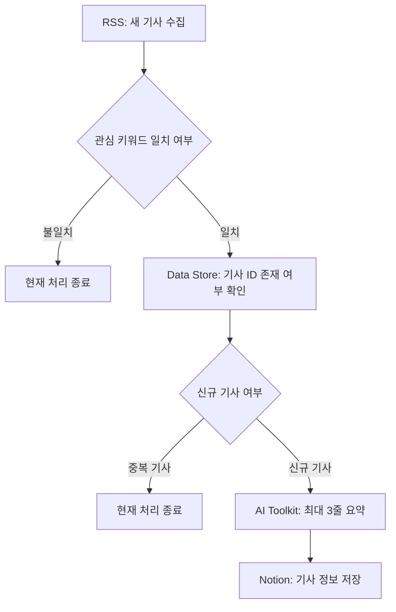
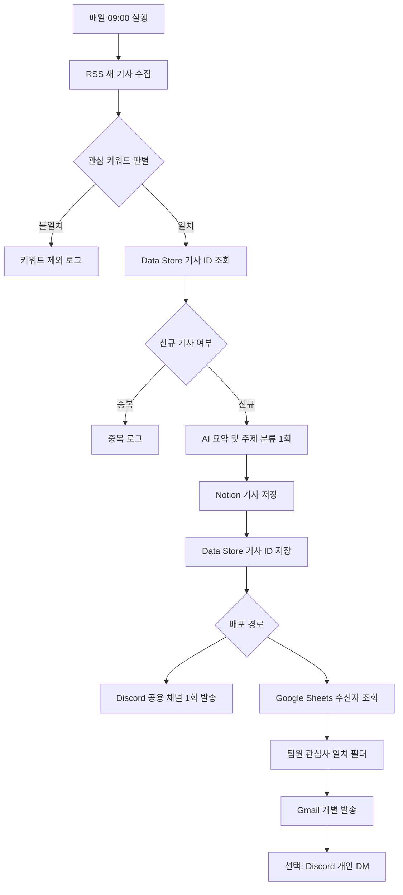

# Make AI 기술 뉴스 브리핑 시나리오 가이드

> RSS 기반 기술 뉴스를 자동 수집하고, 관심 키워드 필터링·중복 확인·AI 요약·Notion 저장까지 수행하는 Make 시나리오의 구조와 인수인계 문서입니다.

---

## 1. 현재 구현 상태

현재 시나리오는 아래 과정까지 구현되어 있습니다.

```text
RSS 기술 뉴스 수집
→ 관심 키워드 필터링
→ Data Store 중복 여부 확인
→ 신규 기사만 AI 요약
→ Notion 데이터베이스 저장
```

부분 테스트 결과, 신규 기사 3건이 Notion의 `AI 기술 뉴스 브리핑` 데이터베이스에 정상 저장되었습니다.

> 현재 Data Store는 **중복 여부 조회만 수행**하고 있습니다.  
> Notion 저장 이후 기사 ID를 Data Store에 기록하는 단계는 아직 추가되지 않았으므로, 중복 방지 기능은 완성 전 상태입니다.

---

## 2. 현재 워크플로우 구조



---

## 3. 모듈별 기능

## 3.1 RSS — Watch RSS Feed Items

### 역할

Ars Technica RSS 피드에서 새로 등록된 기술 뉴스를 가져오는 시작 모듈입니다.

### 현재 설정

```text
RSS URL:
https://feeds.arstechnica.com/arstechnica/index

Maximum number of returned items:
10
```

### 주요 출력값

| 출력값 | 사용 위치 |
|---|---|
| `Title` | 키워드 필터, AI 입력, Notion 제목 |
| `Summary` | 키워드 필터, AI 입력 |
| `URL` | Notion 원문 링크 |
| `id` | Data Store Key, Notion GUID |
| `Date created` | Notion 발행일시 |
| `Source: Name` | Notion 출처 |

### 실행 특징

첫 실행에서는 지정한 시작 지점의 기사들을 가져옵니다.

이후 실행에서는 RSS 모듈이 마지막 처리 위치를 기억하고, 그 이후에 등록된 새 기사만 가져옵니다.

따라서 두 번째 `Run once` 실행에서 아무 기사도 나오지 않는 경우는 오류가 아니라 **새 RSS 항목이 없는 정상 실행**일 수 있습니다.

---

## 3.2 Router — 주제 키워드 분기

### 역할

RSS 기사 제목 또는 요약문에 관심 기술 키워드가 포함되어 있는지 판별합니다.

### 주제 키워드 일치 경로

현재 조건은 다음과 같습니다.

```text
Title matches pattern
OR
Summary matches pattern
```

현재 정규표현식:

```regex
\b(AI|OpenAI|artificial intelligence|generative AI|ChatGPT|Claude|Gemini|LLM|large language model|machine learning|automation|no-code)\b
```

### 주제 키워드 불일치 경로

```text
Fallback route = Yes
```

키워드 일치 경로를 통과하지 못한 기사는 이 경로로 이동합니다.

현재는 후속 모듈이 연결되어 있지 않으므로 이 경로에서 처리가 종료됩니다.

### 추후 추가 권장

```text
키워드 불일치
→ 로그 저장
→ 처리상태 = 제외
→ 제외 사유 = 주제 키워드 불일치
```

---

## 3.3 Data Store — Check the Existence of a Record

### 역할

RSS 기사의 고유 ID가 이미 처리된 기사인지 확인합니다.

### 현재 설정

```text
Data Store:
rss_news_seen

Key:
4. id
```

### 판별 결과

```text
Exists = false
→ 저장된 기록 없음
→ 신규 기사

Exists = true
→ 이미 저장된 기록 있음
→ 중복 기사
```

### 현재 미완성 부분

현재 Data Store는 기사 ID의 존재 여부만 확인합니다.

아직 다음 모듈이 없습니다.

```text
Data Store
→ Add/Replace a Record
```

따라서 현재 구조에서는 처리 완료 기사 ID가 Data Store에 새로 기록되지 않습니다.

---

## 3.4 Router — 신규 기사·중복 기사 분기

### 역할

Data Store의 `Exists` 값을 기준으로 신규 기사와 중복 기사를 구분합니다.

### 신규 기사 경로

```text
6. Exists
Equal to
false
```

신규 기사만 AI 요약 단계로 이동합니다.

### 중복 기사 경로

```text
6. Exists
Equal to
true
```

현재는 후속 모듈이 연결되어 있지 않으므로 이 경로에서 처리가 종료됩니다.

### 추후 추가 권장

```text
중복 기사
→ 로그 저장
→ 처리상태 = 제외
→ 제외 사유 = 기존 처리 기사
```

---

## 3.5 Make AI Toolkit — Simple Text Prompt

### 역할

신규 RSS 기사의 제목과 요약문을 바탕으로 한국어 요약을 생성합니다.

### 현재 모델

```text
Make's AI Provider
OpenAI: GPT-5.4 nano
```

### 현재 입력값

```text
기사 제목:
4. Title

RSS 요약문:
4. Summary
```

### 현재 요약 규칙

```text
- 한국어로 작성
- 전체 출력 최대 3줄
- 각 줄은 한 문장
- 핵심 사실과 의미만 작성
- 입력에 없는 정보는 추측하지 않음
- 정보가 부족하면 세부 내용 확인 필요 표시
- 제목, 번호, 불릿 없이 요약문만 출력
```

### 출력값

```text
9. Answer
```

이 값은 Notion의 `요약` 속성으로 전달됩니다.

### 반드시 유지할 원칙

```text
기사 1건당 AI 호출 1회
```

올바른 구조:

```text
기사 1건
→ AI 요약 1회
→ 같은 요약 결과를 여러 팀원에게 배포
```

피해야 할 구조:

```text
기사 1건
→ 팀원 A용 AI 호출
→ 팀원 B용 AI 호출
→ 팀원 C용 AI 호출
```

---

## 3.6 Notion — Create a Data Source Item

### 역할

AI 요약이 완료된 신규 기사를 Notion 데이터베이스에 저장합니다.

### 연결 데이터베이스

```text
AI 기술 뉴스 브리핑
```

### 현재 속성 매핑

| Notion 속성 | Make 매핑값 |
|---|---|
| 제목 | `4. Title` |
| 요약 | `9. Answer` |
| 원문링크 | `4. URL` |
| 발행일시 | `4. Date created` |
| 발행일시 시간 포함 | `Yes` |
| 출처 | `4. Source: Name` |
| GUID | `4. id` |
| 처리상태 | 직접 입력 `완료` |
| 처리일시 | `now` |
| 처리일시 시간 포함 | `Yes` |

### 날짜 매핑 구분

```text
발행일시
= 기사가 실제 발행된 시간
= 4. Date created

처리일시
= Make에서 기사를 처리한 시간
= now
```

---

## 4. 현재 전체 워크플로우

```text
[RSS: 새 기사 수집]
        ↓
[Router: 관심 키워드 판별]
        ├─ 키워드 불일치
        │     └─ 현재 처리 종료
        │
        └─ 키워드 일치
              ↓
      [Data Store: 기사 ID 존재 여부 확인]
              ↓
      [Router: 신규·중복 판별]
              ├─ 중복 기사
              │     └─ 현재 처리 종료
              │
              └─ 신규 기사
                    ↓
            [AI: 최대 3줄 한국어 요약]
                    ↓
            [Notion: 기사 정보 저장]
```

---

## 5. 앞으로 추가해야 할 과정

## 5.1 Data Store 처리 기록 저장

Notion 모듈 뒤에 다음 모듈을 추가합니다.

```text
Data Store
→ Add/Replace a Record
```

설정:

```text
Data Store:
rss_news_seen

Key:
4. id
```

### 반드시 유지할 순서

권장:

```text
Notion 저장 성공
→ Data Store에 기사 ID 저장
```

비권장:

```text
Data Store에 먼저 기록
→ Notion 저장 실패
→ 다음 실행에서 이미 처리된 기사로 오판
```

---

## 5.2 Google Form 및 Google Sheet 연결

조장님이 Google Form을 만들고, 응답이 Google Sheet에 자동 저장되도록 구성합니다.

### 권장 Form 항목

```text
이름
Gmail 주소
관심 이슈 분야
세부 관심 키워드
이메일 수신 여부
Discord 수신 여부
Discord 사용자 ID
개인정보·자동 발송 동의 여부
```

### 권장 Sheet 헤더

```text
제출일시
이름
Gmail
관심주제
세부키워드
이메일수신
Discord수신
Discord사용자ID
동의여부
```

### Make에 추가할 모듈

```text
Google Sheets
→ Search Rows
```

조회 조건 예시:

```text
이메일수신 = 예
동의여부 = 동의
Gmail = 빈칸 아님
```

> Google Sheet 열 이름은 Make 매핑 전에 확정하는 것이 좋습니다.  
> 열 이름을 변경하면 기존 매핑을 다시 연결해야 할 수 있습니다.

---

## 5.3 기사 관심 주제와 팀원 관심사 비교

현재 AI 모듈은 요약문만 반환합니다.

팀원별 맞춤 발송을 위해서는 기사마다 다음 값이 필요합니다.

```text
기사 주제
기사 핵심 키워드
```

### 1차 구현

현재 수집 범위가 AI 기사 중심이므로 아래 조건으로 시작할 수 있습니다.

```text
관심주제 contains AI
OR
관심주제 contains 생성형 AI
```

### 확장 구현

기사 주제를 아래처럼 분류할 수 있습니다.

```text
생성형 AI
자동화·노코드
보안
클라우드
개발·코딩
로봇
반도체
IT 비즈니스
```

### 분류 방법

#### 방법 A — Router에서 키워드 분류

```text
ChatGPT, OpenAI, Claude, Gemini
→ 생성형 AI

automation, no-code, Zapier, Make
→ 자동화·노코드
```

#### 방법 B — 기존 AI 호출에서 요약과 주제를 동시에 출력

현재 AI 프롬프트에서 다음 값을 한 번에 생성하도록 수정합니다.

```text
요약
주제
핵심 키워드
```

> 두 번째 AI 분류 모듈을 추가하지 않고 기사 1건당 AI 호출 1회를 유지하는 것이 좋습니다.

---

## 5.4 Gmail 발송

### 추가 모듈

```text
Gmail
→ Send an Email
```

### 권장 매핑

```text
To:
Google Sheets의 Gmail

Subject:
[AI 기술 뉴스] 4. Title

Body:
안녕하세요, [이름]님.

관심 주제와 관련된 새로운 기술 뉴스입니다.

[기사 제목]
4. Title

[요약]
9. Answer

[출처]
4. Source: Name

[원문]
4. URL
```

### 개인정보 보호 원칙

팀원 이메일을 하나의 `To` 또는 `CC`에 모두 넣지 않습니다.

```text
Google Sheets의 각 행
→ 해당 팀원에게 개별 발송
```

---

## 5.5 Discord 발송

### 권장 방식 — 공용 채널

```text
Discord
→ Send a Message
→ Send a message to a channel
```

공용 채널 방식을 사용하면 팀원별 Discord ID를 받지 않아도 됩니다.

### 권장 메시지

```text
📌 AI 기술 뉴스

제목:
4. Title

요약:
9. Answer

출처:
4. Source: Name

원문:
4. URL
```

### 배치 위치

공용 Discord 알림은 Google Sheets의 팀원별 반복 처리 밖에 배치합니다.

올바른 구조:

```text
기사 1건
→ Discord 공용 채널 1회 발송
→ Google Sheets 팀원별 Gmail 발송
```

피해야 할 구조:

```text
팀원 A → Discord 발송
팀원 B → Discord 발송
팀원 C → Discord 발송
```

### 개인 DM 방식

개인 DM을 사용하는 경우 다음 값이 필요합니다.

```text
Discord수신 여부
Discord사용자ID
```

Discord 닉네임이 아니라 숫자로 된 사용자 ID를 사용합니다.

---

## 5.6 로그 기록

현재 다음 경로에는 기록 모듈이 없습니다.

```text
키워드 불일치
중복 기사
오류 발생
```

### 권장 로그 항목

```text
처리일시
기사 제목
기사 ID
원문 URL
처리 결과
제외 또는 실패 사유
오류 메시지
재시도 횟수
```

### 처리 결과 예시

```text
SUCCESS
SKIPPED_KEYWORD
SKIPPED_DUPLICATE
FAILED_AI
FAILED_NOTION
FAILED_GMAIL
FAILED_DISCORD
```

로그 저장 위치 후보:

```text
별도 Google Sheet
별도 Notion 로그 DB
Data Store
```

---

## 5.7 오류 처리 및 재시도

다음 외부 모듈을 중심으로 오류 처리 경로를 추가합니다.

```text
AI Toolkit
Notion
Google Sheets
Gmail
Discord
```

목표:

```text
오류 발생
→ 최대 2회 재시도
→ 최종 실패 시 로그 기록
```

---

## 5.8 실행 스케줄

전체 테스트가 끝난 후 설정합니다.

```text
실행 주기:
매일

실행 시각:
09:00

시간대:
Asia/Seoul
```

테스트 중에는 스케줄을 `OFF`로 유지합니다.

---

## 6. 권장 최종 워크플로우



---

## 7. 조장님 시나리오와 통합할 때 체크할 점

## 7.1 동일 시나리오인지 복사본인지 확인

### 같은 Make 조직·팀에서 공동 편집

```text
조장님 수정
→ 준수 화면에도 반영

준수 수정
→ 조장님 화면에도 반영
```

### Blueprint 복사본

```text
준수 원본
≠
조장님 복사본
```

두 시나리오는 자동 동기화되지 않습니다.

---

## 7.2 통합 전 Blueprint 백업

```text
Scenario 우측 상단 점 3개
→ Export blueprint
```

권장 파일명:

```text
TEAM_MISSION_B_before_integration.blueprint.json
```

---

## 7.3 동시에 편집하지 않기

권장 작업 순서:

```text
1. 조장님이 Form·Sheet 구조 확정
2. 준수가 Make에 Sheet 모듈 연결
3. 조장님이 Gmail·Discord 계정 인증
4. 준수가 전체 매핑과 필터 확인
5. 한 명이 Run once 테스트
```

한 사람이 저장을 완료한 뒤 다음 사람이 작업합니다.

---

## 7.4 연결 계정 확인

| 연결 | 확인할 내용 |
|---|---|
| Notion | 현재 DB에 쓰기 권한이 있는가 |
| Google Sheets | Form 응답 Sheet에 접근 가능한가 |
| Gmail | 실제 발송에 사용할 계정인가 |
| Discord | 해당 서버와 채널에 메시지 권한이 있는가 |
| AI Toolkit | 모델을 정상 사용할 수 있는가 |

---

## 7.5 Google Sheet 열 이름 확정

```text
이름
Gmail
관심주제
세부키워드
이메일수신
Discord수신
Discord사용자ID
동의여부
```

---

## 7.6 Google Form을 메인 트리거로 사용하지 않기

권장:

```text
매일 스케줄
→ RSS
→ 기사 처리
→ Google Sheet에서 현재 수신자 목록 조회
```

비권장:

```text
Google Form 응답 발생
→ RSS 뉴스 전체 처리
```

---

## 7.7 Data Store 통합 확인

```text
Data Store 이름:
rss_news_seen

조회 Key:
4. id

저장 Key:
4. id
```

조회와 저장에서 같은 Key를 사용해야 합니다.

---

## 7.8 Notion 속성 확인

```text
제목
요약
원문링크
발행일시
출처
GUID
처리일시
처리상태
```

Notion 속성 이름이나 유형을 변경하면 Make 매핑을 다시 확인합니다.

---

## 7.9 테스트 데이터 구분

권장 테스트 순서:

```text
1. 테스트 기사 1건
2. 테스트 Gmail 1개
3. 테스트 Discord 채널
4. Notion 저장 확인
5. Data Store 기록 확인
6. 동일 기사 재실행 후 중복 차단 확인
7. 실제 팀원 정보로 전환
```

---

## 8. 수정해도 되는 부분

| 항목 | 수정 가능 내용 |
|---|---|
| 시나리오 이름 | `TEAM_MISSION_B_AI_NEWS` 등으로 변경 |
| RSS 주소 | 다른 기술 뉴스 RSS 추가·교체 |
| RSS 최대 수집 수 | 10건에서 조정 |
| 키워드 | 팀원 관심 분야에 맞게 추가·삭제 |
| Router 경로 이름 | 이해하기 쉬운 이름으로 변경 |
| AI 모델 | 비용·성능에 따라 교체 |
| AI 문체 | 더 간결한 요약, 중요도 표시 등 |
| Notion DB | 다른 DB로 변경 가능 |
| Notion 속성명 | 변경 후 Make 매핑도 같이 수정 |
| 처리상태 값 | 완료, 성공, 저장완료 등 |
| 이메일 제목·본문 | 팀 프로젝트 형식에 맞게 변경 |
| Discord 메시지 | 텍스트 또는 Embed 형식으로 변경 |
| 실행 시간 | 팀 합의에 따라 조정 |
| 로그 저장 위치 | Sheets, Notion, Data Store 중 선택 |

---

## 9. 반드시 남겨둬야 하는 부분

### 기사 고유값

```text
4. id
```

사용 위치:

```text
Data Store 조회 Key
Data Store 저장 Key
Notion GUID
로그 기사 ID
```

### 중복 확인은 AI보다 먼저

```text
Data Store 중복 확인
→ 신규 기사만 AI 요약
```

### 신규·중복 조건

```text
Exists = false
→ 신규 기사

Exists = true
→ 중복 기사
```

### AI 호출 1회 원칙

```text
기사 1건
→ AI 1회
```

### Notion 핵심 매핑

```text
제목 = RSS Title
요약 = AI Answer
원문링크 = RSS URL
GUID = RSS id
발행일시 = RSS Date created
처리일시 = now
```

### Data Store 저장 시점

```text
Notion 저장 성공
→ Data Store Add/Replace Record
```

### 팀원 반복은 AI 이후

```text
AI 요약
→ Google Sheets 수신자 조회
→ 팀원별 발송
```

### Discord 공용 채널은 팀원 반복 밖에 배치

```text
기사당 Discord 1회
```

---

## 10. 피해야 할 수정

```text
Data Store 조회 모듈 삭제
신규·중복 Router 삭제
기사 ID 대신 제목만으로 중복 확인
팀원 수만큼 AI 모듈 반복
RSS Author를 출처로 저장
발행일시에 now 사용
처리일시에 기사 발행일 사용
팀원 이메일을 하나의 To 또는 CC에 모두 입력
Discord 공용 메시지를 팀원별 반복 경로에 배치
테스트가 끝나기 전에 스케줄 활성화
Data Store 기록 없이 RSS 시작 지점을 반복 초기화
```

---

## 11. 최종 통합 체크리스트

### 기존 시나리오

- [ ] RSS 기사 수집 정상
- [ ] 키워드 일치·불일치 분기 정상
- [ ] Data Store 존재 여부 조회 정상
- [ ] 신규·중복 분기 조건 정상
- [ ] AI 요약 최대 3줄
- [ ] 기사 1건당 AI 호출 1회
- [ ] Notion 전체 속성 저장 정상
- [ ] 발행일시와 처리일시 구분 정상

### 추가 구현

- [ ] Notion 뒤 Data Store `Add/Replace a Record` 추가
- [ ] 키워드 불일치 로그 추가
- [ ] 중복 기사 로그 추가
- [ ] Google Form 항목 확정
- [ ] Google Sheet 헤더 확정
- [ ] Google Sheets `Search Rows` 연결
- [ ] 팀원 관심사 필터 추가
- [ ] Gmail 개별 발송 추가
- [ ] Discord 공용 채널 또는 DM 방식 결정
- [ ] 오류 처리 및 최대 2회 재시도
- [ ] 실패 로그 추가
- [ ] 매일 실행 스케줄 설정

### 통합 안전 점검

- [ ] 통합 전 Blueprint 백업
- [ ] 동일 시나리오인지 복사본인지 확인
- [ ] 두 사람이 동시에 편집하지 않기
- [ ] Notion 연결 권한 확인
- [ ] Google Sheet 접근 권한 확인
- [ ] Gmail 실제 발송 계정 확인
- [ ] Discord 서버·채널 권한 확인
- [ ] 테스트 수신자로 먼저 실행
- [ ] 동일 기사 재실행 시 중복 차단 확인
- [ ] 최종 확인 후 스케줄 ON

---

## 12. 최종 요약

현재 시나리오는 아래 핵심 파이프라인까지 구현되어 있습니다.

```text
RSS 수집
→ 기술 키워드 필터
→ 중복 여부 조회
→ 신규 기사 AI 요약
→ Notion 저장
```

통합 시 가장 먼저 추가해야 하는 과정:

```text
Notion 저장
→ Data Store 기사 ID 기록
```

그다음 조장님이 준비한 Google Form·Google Sheet를 연결해 아래 흐름으로 확장합니다.

```text
팀원 관심사 조회
→ 관심사 일치 필터
→ Gmail 개별 발송
→ Discord 알림
```

다음 원칙은 반드시 유지해야 합니다.

```text
중복 확인은 AI보다 먼저 수행
기사 1건당 AI 호출 1회
Data Store 조회·저장 Key는 모두 4. id
Notion 저장 성공 후 Data Store에 기사 ID 기록
팀원별 반복 처리는 AI 요약 이후에 수행
```
